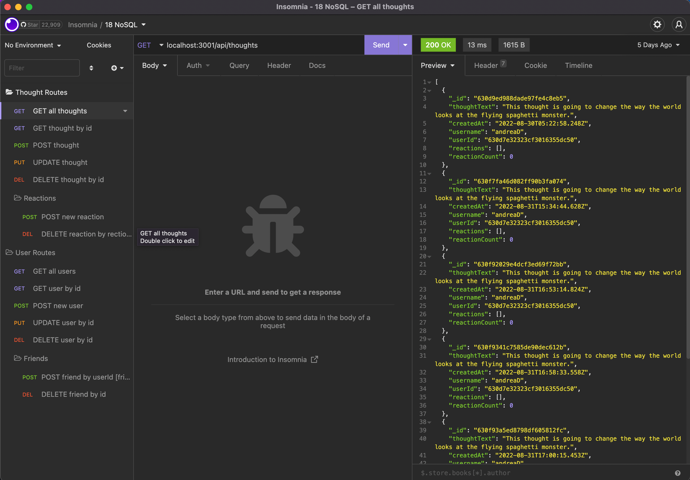

# NoSQL Social Network API

## Description

An API for a mock social network that uses NoSQL

## Walkthrough Video

[Walkthrough Video](https://vimeo.com/746624363/5ac2ac0fcc)

## Table of Contents

- [Installation](#installation)
- [Usage](#usage)

## Installation

1. Download dependencies by runnning `npm i`
2. Download most recent version of Insomnia

## Usage

1. Start server by running `npm start` or `node server.js` in the command line.
2. Open Insomnia to test routes

## License

## Questions

If you have any questions, you can reach me at:

- [GitHub: J0J0C0DING](https://github.com/J0J0C0DING)
- [joey.rebne@yahoo.com](mailto:joey.rebne@yahoo.com)
